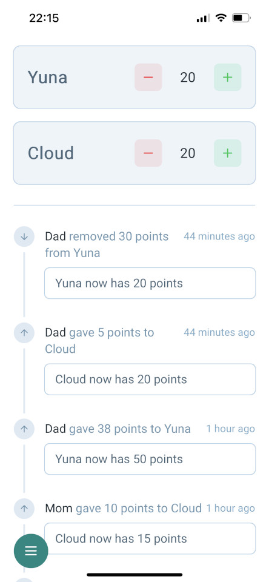

# initialxy-points

A simple web app that helps track points earned by kids and allows them to redeem points for rewards.

This project was created as a personal Raspberry Pi project to help manage my children's point-based reward system. I wanted to experiment with fully local development using my Radeon RX 7900 XTX, so I generated much of the code with local LLMs while still maintaining strict quality control - reviewing every line of code to ensure it meets my expectations.

**Important Security Notice**: This application is designed for use in a home network environment only. It is not intended for public access or production use and is not secure. Do not deploy this application publicly.




## Project Overview

initialxy-points is designed to help parents track their children's points that they earn through tasks and activities. It features a simple, intuitive interface for both parents and kids to manage rewards and point tracking.

## Features

- Point tracking for children's tasks and activities
- Parent-child role-based access control
- Activity logging
- Admin console for database management

## Setup

Make sure to install dependencies:

```bash
npm install
```

## Development Server

First, run the admin console to initialize your database:

```bash
npm run admin
```

This will launch an admin console for managing users. Enter a SQLite database file path to get started (e.g., `database.sqlite`). Run `init-db` to create database tables.

During development, you can create a `.env` file with the following variables:

* `NUXT_SESSION_PASSWORD` - A secret password for session encryption. When you run the development server for the first time, one will be generated for you.
* `DB_PATH` - Path to the SQLite database file that you just created and initialized (e.g., `database.sqlite`).

Start the development server on `http://localhost:3000`:

```bash
npm run dev
```

### Admin Console Commands

The admin console provides these commands:

- `help` - Show this help message
- `init-db` - Initialize database
- `list` - Show all users and their roles
- `add-user <username> <password> [role]` - Add a new user
- `delete-user <username>` - Delete a user
- `rename-user <oldUsername> <newUsername>` - Rename a user
- `change-user-role <username> <role>` - Change a user's role
- `set-password <username> <password>` - Set a new password for a user
- `show-logs <n>` - Show top n log entries
- `exit` - Exit the admin console

## Deployment

[Follow Nuxt Deployment process](https://nuxt.com/docs/4.x/getting-started/deployment). Build the application for production:

```bash
npm run build
```

Make sure you set `NUXT_SESSION_PASSWORD` and `DB_PATH` environment variables before running the node server. You can generate a new session password with:

```bash
node -e "console.log(require('crypto').randomBytes(32).toString('hex'))"
```

Start the node server:

```bash
node .output/server/index.mjs
```

## API Documentation

For detailed information about the available API endpoints, request/response formats, and authentication, see the [API Documentation](docs/api.md).

## AI Tools
As mentioned above, the objective of this project is to exercise using *local* LLM for coding. The original objective was to generate near 100% of the code, but it quickly became apparent that it is not feasible. Overall in terms of lines of code, I'd estimate around 60% of the code was generated by LLM, though I have humanly reviewed all of them. Here are the tools that I used:
* [Roo Code](https://github.com/RooCodeInc/Roo-Code) - with code indexing
* [llama.cpp](https://github.com/ggml-org/llama.cpp) - For serving models
* [ollama](https://ollama.com/) - for serving embedding model separately in CPU mode
* [Qdrant](https://qdrant.tech/) - vector database for indexing with Roo Code
* [Devstral](https://mistral.ai/news/devstral) (during early development)
* [Qwen3-Coder](https://github.com/QwenLM/Qwen3-Coder) (current model)

Here is the script I use for launching them using llama.cpp

```bash
#!/bin/bash
cd /home/initialxy/ML/llm/llama.cpp/build/bin

session_name="llamacppstart"
command1='docker run -p 6333:6333 qdrant/qdrant'
command2='ollama serve'
# command3='./llama-server -m ~/ML/llm/models/Devstral-Small-2507-IQ4_XS.gguf -ngl 999 -c 131072 -fa -ctk q8_0 -ctv q8_0 --prio 2 --temp 0.15 --repeat-penalty 1.0 --min-p 0.01 --top-k 64 --top-p 0.95 --alias devstral'
command3='./llama-server -m ~/ML/llm/models/Qwen3-Coder-30B-A3B-Instruct-Q4_K_M.gguf --threads -1 -ngl 999 -c 262144 -fa -ctk q8_0 -ctv q8_0 --temp 0.7 --min-p 0.0 --top-p 0.80 --top-k 20 --repeat-penalty 1.05 -ot ".ffn_(up|down)_exps.=CPU" --alias qwen3-coder'
tmux new-session -d -s "$session_name"
tmux split-window -h -t "$session_name":0
tmux split-window -h -t "$session_name":0
tmux send-keys -t "$session_name":0.0 "$command1" C-m
tmux send-keys -t "$session_name":0.1 "$command2" C-m
tmux send-keys -t "$session_name":0.2 "$command3" C-m
tmux attach -t "$session_name"
```

## License

This project is licensed under the MIT License. See the [LICENSE](LICENSE) file for details.